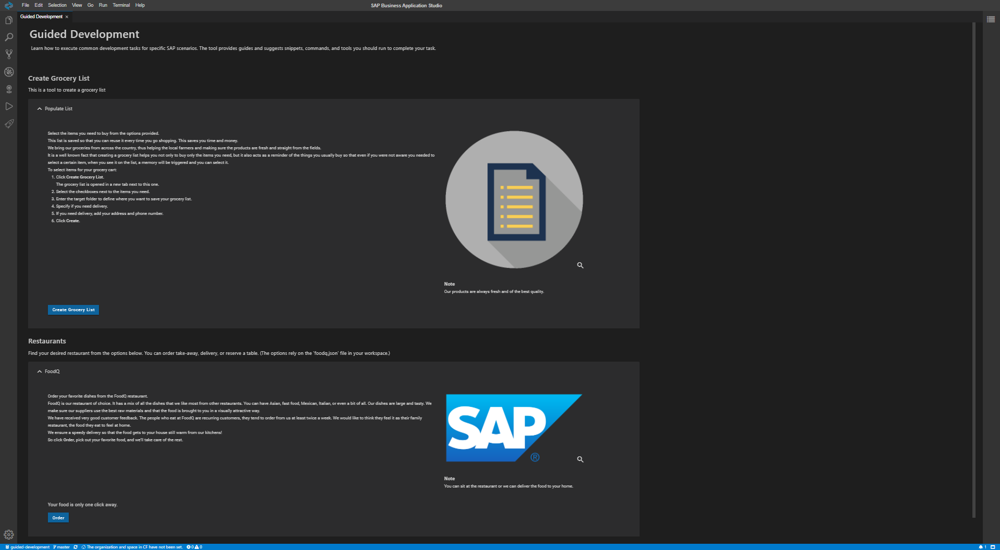

[](https://github.com/SAP/guided-development/actions/workflows/ci.yml)
[](https://coveralls.io/github/SAP/guided-development?branch=master)
[](http://commitizen.github.io/cz-cli/)

[](https://api.reuse.software/info/github.com/SAP/guided-development)

# Guided Development



## Description
This extension allows developers to add generic code pieces to their project and provide wizard-like experience with minor development efforts.
The repository contains three main packages:
* **Frontend** - The Guided Development as a standalone vue.js application.
* **Backend** - The backend part. Runs as a VSCode extension or node.js application.
* **guided-development-types** - TypeScript type definitions for building your own contributor extensions, published to [npm](https://www.npmjs.com/package/@sap_oss/guided-development-types).

## Sample Contributors

The repository also includes a collection of ready-to-explore sample contributor extensions. They are a great starting point for understanding how to integrate with the Guided Development framework and for building your own contributor.

| Package | What it demonstrates |
|---|---|
| [`vscode-simple-contrib`](vscode-simple-contrib/) | The minimal contributor — a single collection with one item. Start here. |
| [`vscode-contrib1`](vscode-contrib1/) | A richer scenario showing multiple action types and cross-contributor item reuse. |
| [`vscode-contrib2`](vscode-contrib2/) | A platform-oriented collection, and how one contributor can reference items from another. |
| [`vscode-contrib3`](vscode-contrib3/) | A full-featured example covering project setup, snippet actions, and deployment workflows. |
| [`vscode-contrib-cake`](vscode-contrib-cake/) | Dynamic collections — adds or removes guides based on files detected in the workspace. |
| [`vscode-snippet-food-contrib`](vscode-snippet-food-contrib/) | Combining Guided Development with the code-snippet API for questionnaire-driven workflows. |

Each sample is an independent VSCode extension. To build and run one, `cd` into its folder and run:
```bash
npm install
npm run compile
```
Then open the repository in VSCode and launch the extension from the **Run and Debug** panel.

## Requirements
* [node.js](https://www.npmjs.com/package/node) version 22 or higher.
* [VSCode](https://code.visualstudio.com/) 1.46.0 or higher.

## Download and Installation
To test run the framework you only need to build and install the backend package, which will automatically build and run the UI.
### installation
* Clone this repository
* cd into the backend folder
    ```bash
    cd backend
    ```
* To install, compile and prepare the static resources run the following commands:
    ```bash
    npm run backend
    npm run frontend
    ```

### Usage & Development
#### Run the dev mode
Dev mode allows you to run the framework in the browser, using vue cli for fast development cycles, and easy debug tools.
To run it do the following:
* In the backend folder run webpack or webpack-dev, then run the server.
    ```bash
    npm run webpack-dev
    npm run ws:run
    ```
* In the frontend folder run serve
    ```bash
    npm run serve
    ```
* Open the broswer on localhost:8080 to access the framework.

#### Run the VSCode extension
* Start VSCode on your local machine, and click on open workspace. Select this repo folder.
* On the debug panel choose **Run Guided Development Extensions**, and click on the **Run** button.

#### Advanced scenarios
To develop and contribute you can build and install each package separately. Instruction on each package in the dedicated readme.md file.
* [Build & install the client](frontend/README.md)
* [Build & install the backend](backend/README.md)

## How to obtain support
To get more help, support, and information please open a github [issue](https://github.com/SAP/guided-development/issues).

## Contributing
Contributing information can be found in the [CONTRIBUTING.md](CONTRIBUTING.md) file.
